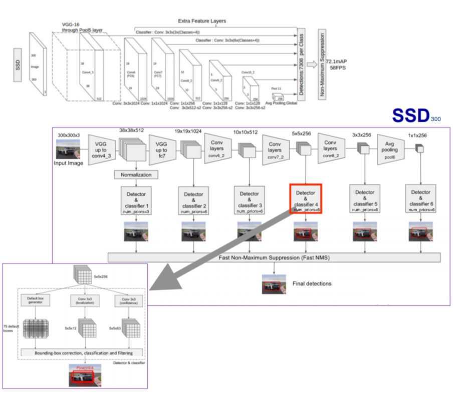

# Experiments:

## Affinity Coefficient:

## Class activation map:

### example:

	https://www.youtube.com/watch?v=fZvOy0VXWAI&t=5s

### dataset:

	https://vimeo.com/146492001

## Image segmentation:

### example:
	https://www.depends-on-the-definition.com/unet-keras-segmenting-images/
	
### dataset:

	https://bdd-data.berkeley.edu/
	https://www.cityscapes-dataset.com/
	http://cocodataset.org
	
## SSD:
	
Weights are ported from the original models and are available [here](https://mega.nz/#F!7RowVLCL!q3cEVRK9jyOSB9el3SssIA). You need `weights_SSD300.hdf5`.

	

